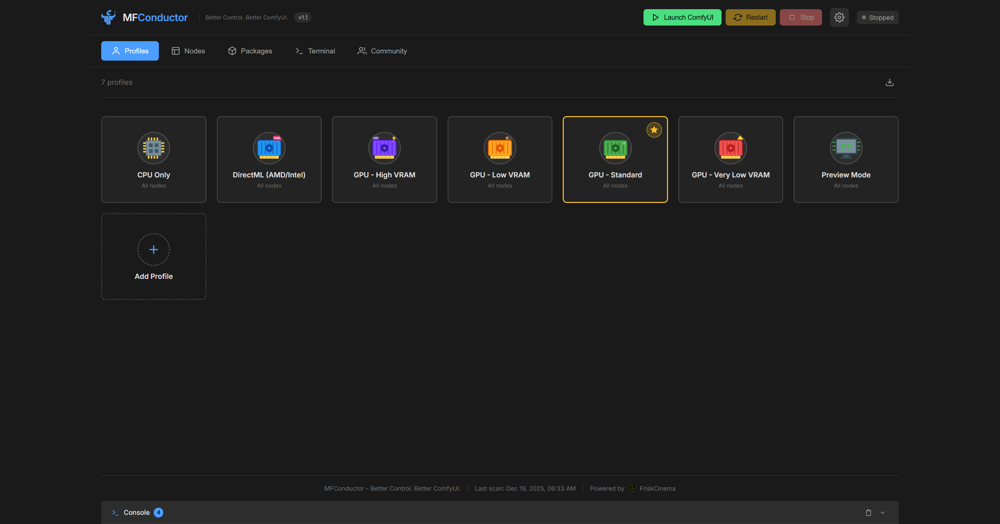
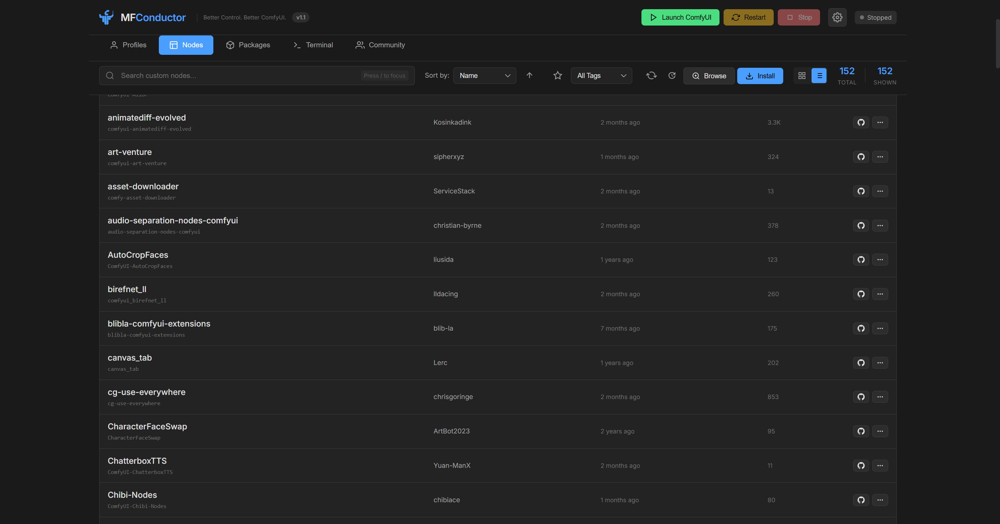
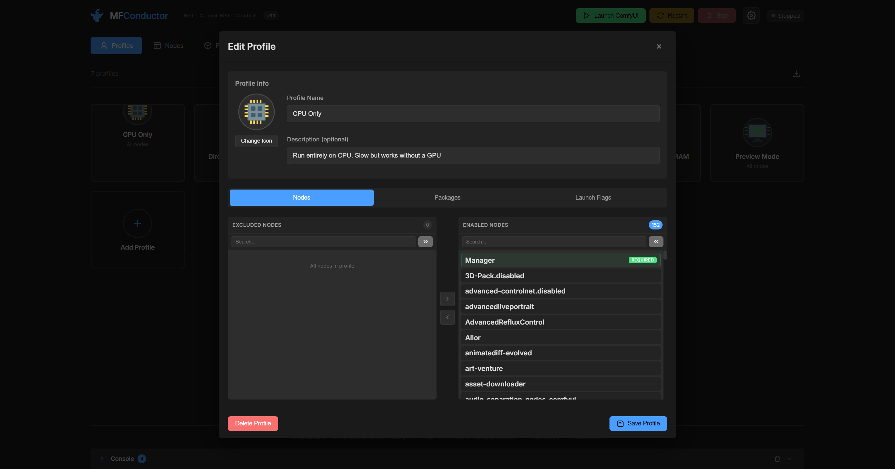

# MF Conductor

<p align="center">

</p>

<h3 align="center">The Ultimate ComfyUI Control Center</h3>

<div align="center">

</div>

<p align="center">
Take complete control of your ComfyUI environment. Profile-based launching, surgical node management, package control, and real-time console monitoring—unified in one interface.
</p>

<p align="center">
<strong>
<a href="#-features">FEATURES</a> &nbsp;•&nbsp;
<a href="#-installation">INSTALLATION</a> &nbsp;•&nbsp;
<a href="#-usage">USAGE</a> &nbsp;•&nbsp;
<a href="#-profiles">PROFILES</a> &nbsp;•&nbsp;
<a href="#-shortcuts">SHORTCUTS</a>
</strong>
</p>

---

## Screenshots

<p align="center">

<br><em>Profiles Tab - Manage multiple ComfyUI configurations</em>
</p>

<p align="center">

<br><em>Nodes Tab - View, search, and manage custom nodes</em>
</p>

<p align="center">

<br><em>Profile Editor - Select enabled/excluded nodes per profile</em>
</p>

---

## ⬢ Features

### ❖ Profile System

The core of the application. Manage launch configurations that control every aspect of the environment.

* **Preset Profiles** — Built-in configs for **GPU Standard**, **High VRAM**, **CPU Only**, **DirectML**, and **Preview Mode**.
* **Context Isolation** — Select exactly which custom nodes are active per profile.
* **Launch Flags** — Configure VRAM limits (`--lowvram`), attention modes, and preview methods visually.
* **Package Exclusion** — Prevent specific Python packages from loading to avoid conflicts.
* **Desktop Shortcuts** — Generate Windows shortcuts to launch specific profiles directly from your desktop.

### ❖ Node Management

A clean, functional interface for the custom node ecosystem.

* **Visual Node List** — Auto-strips redundant prefixes for readability.
* **Live Search** — Debounced filtering by name, author, or status.
* **GitHub Integration** — Direct links to repositories and star counts.
* **Bulk Operations** — Update or disable multiple nodes simultaneously.
* **Install from URL** — Direct Git repository installation support.

### ❖ Live Console

Real-time process control and monitoring.

* **Embedded Output** — View standard output (stdout) and errors (stderr) directly in the UI.
* **Process Control** — Start, Stop, and Restart the ComfyUI server.
* **Status Indicators** — Visual feedback for server state (Initializing, Running, Stopped).

---

## ⭳ Installation

### Method 1: ComfyUI Manager

1. Open **ComfyUI Manager**.
2. Search for `MF Conductor`.
3. Click **Install**.

### Method 2: Git Clone

```bash
cd ComfyUI/custom_nodes
git clone https://github.com/squarewulf/ComfyUI_MFConductor.git

```

### Method 3: Manual

1. Download the latest archive from [Releases](https://github.com/squarewulf/ComfyUI_MFConductor/releases).
2. Extract to `ComfyUI/custom_nodes/ComfyUI_MFConductor`.
3. Restart ComfyUI.

---

## ➤ Usage

MF Conductor supports two operational modes:

### Standalone Mode

*Recommended for full management capabilities.*

Execute `Launch_MFConductor.bat` or run:

```bash
python standalone_server.py

```

> **Access:** `http://localhost:8199`
> **Benefits:** Manage nodes while ComfyUI is running; view live startup logs; "Go To Comfy" button appears when server is ready.

### Integrated Mode

*Recommended for quick adjustments.*

Access directly within a running ComfyUI instance via the sidebar or URL:

```text
http://localhost:8188/mf_conductor/

```

---

## ⚙ Profiles

Profiles define the state of the ComfyUI runtime.

### Included Presets

| Profile | Target Hardware | Description |
| --- | --- | --- |
| **GPU Standard** | Most GPUs | Balanced configuration. |
| **GPU High VRAM** | 16GB+ | Maximizes caching and performance. |
| **GPU Low VRAM** | 6-8GB | Optimizes VRAM usage (`--lowvram`). |
| **CPU Only** | CPU | Runs without GPU acceleration (`--cpu`). |
| **DirectML** | AMD/Intel (Win) | Uses DirectML backend. |

### Configuration Logic

When a profile is launched, MF Conductor performs the following operations:

1. Renames **disabled** nodes to `folder_name.disabled`.
2. Renames **enabled** nodes to remove the `.disabled` extension.
3. Injects selected launch flags (e.g., `--preview-method auto`).

> **Note:** This renaming mechanism is fully compatible with ComfyUI-Manager.

---

## ⌨ Shortcuts

Efficiently navigate the interface using keyboard commands.

| Key | Function |
| --- | --- |
| <kbd>/</kbd> | Focus Search Field |
| <kbd>R</kbd> | Refresh Node List |
| <kbd>N</kbd> | Open Install Modal |
| <kbd>B</kbd> | Browse Node Library |
| <kbd>U</kbd> | Check for Updates |
| <kbd>Esc</kbd> | Close Active Modal |

---

## ℹ Technical Details

<details>
<summary><strong>File Structure</strong></summary>

```text
ComfyUI_MFConductor/
├── standalone_server.py     # Independent HTTP server (Port 8199)
├── node_scanner.py          # Node detection logic
├── git_utils.py             # Git wrapper for updates/installs
├── user_data.py             # Profile JSON management
├── profiles/                # Generated batch launch scripts
├── data/
│   └── profiles.json        # User profile database
└── web/                     # Frontend assets (Vanilla JS/CSS)

```

</details>

<details>
<summary><strong>Troubleshooting</strong></summary>

**"Git not found" error**
Ensure Git is installed and available in the system PATH variables.

**Console shows "Running (external)"**
This status appears when ComfyUI is started externally (not via MF Conductor). To view live logs, launch ComfyUI using the MF Conductor interface.

**Garbled Console Text**
This is typically a Windows CLI encoding issue. It does not affect functionality.

</details>

---

<p align="center">
<strong>Powered by <a href="[https://friskcinema.com](https://friskcinema.com)">FriskCinema</a></strong>
</p>